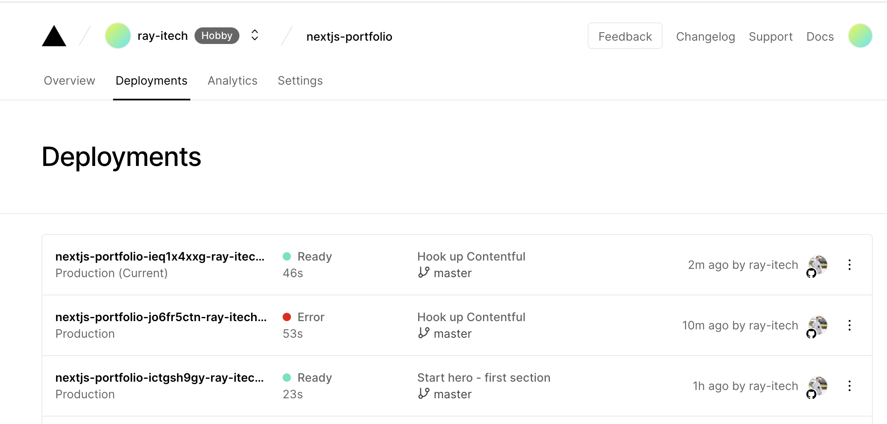

# Ray - Portfolio Next.js

https://ray-portfolio.vercel.app/

### Tech Stack

- Next.js
- TypeScript
- Contentful
- Vercel

## Getting Started

1. Install dependencies: `yarn`
1. Populate `.env.local`
1. Start local: `yarn dev` on http://localhost:3000
1. To view an API endpoint connecting with GitHub API, visit `http://localhost:3000/api/github`

To build statically, run `yarn build` and view the generated HTML in the `./out` directory.

## Linting

Run `yarn lint` to view warnings/errors. Add `--fix` to fix.

## CI/CD

Automated build, checks and deployment is handled via Vercel.

